```{r setup, include=FALSE}
knitr::opts_chunk$set(fig.width = 50, fig.height = 50, warning = FALSE, message = FALSE, echo = FALSE, cache = FALSE, eval = FALSE)

dir_wili_2018 = '/IN CASE I WANT TO REBUILD THE VIGNETTE MODIFY AND POINT THIS DIR TO THE WILLI 2018 DIRECTORY/wili-2018'
dir_files = '/IN CASE I WANT TO REBUILD THE VIGNETTE MODIFY AND POINT THIS DIR TO THE HUMAN DECLARATION FILES/declaration_human_rights'         # the other 'dir_files' directory in line 663 is mentioned just in case I download the declaration files inside the 'wili-2018' directory

```

In this blog post, I'll explain how to perform **Language Identification** with the [fastText](https://github.com/mlampros/fastText) R package and I'll create a benchmark by including other *language identification* R packages, i.e. 

* [cld2](https://github.com/ropensci/cld2), R Wrapper for Google's Compact Language Detector 2 
* [cld3](https://github.com/ropensci/cld3), Bindings to Google's Compact Language Detector 3 
* [textcat](https://CRAN.R-project.org/package=textcat), N-Gram Based Text Categorization
* [franc](https://github.com/gaborcsardi/franc), Port of the JavaScript 'franc', Detect the Language of Text

I didn't use any packages that make calls to API's because the dataset I'll utilize consists of more than 50.000 thousand observations. 

Based on my search on the web, currently, the [WiLI benchmark dataset](https://arxiv.org/abs/1801.07779) is among the ones that contain multilingual texts (Wikipedia extracts of 235 languages) and the corresponding labels as well. It can be downloaded either from [Zenodo](https://zenodo.org/record/841984#.YH3BBupRUV1) or from my [Datasets](https://github.com/mlampros/DataSets) Github repository.

We currently live in the *Covid-19 Era* and there are many human rights violation incidents (more often than before), therefore I decided to include in this benchmark also the human rights declarations of the 3 most spoken languages (Chinese, Enlish, Spanish) because they are more relevant than ever. The human rights declarations of the mentioned languages can be downloaded either from the [official website](https://www.un.org/en/about-us/universal-declaration-of-human-rights) or from my [Datasets](https://github.com/mlampros/DataSets) Github repository, and I think it deserves a read from time to time so that we don't forget our rights as human beings.
<br>


### Benchmark based on the WiLI dataset

The *fastText* language identification pre-trained models support currently 176 languages. The following character vector shows the available *language isocodes*. 

```{r, echo = T}

fasttext_supported_languages = c('af', 'als', 'am', 'an', 'ar', 'arz', 'as', 'ast', 'av', 
                                 'az', 'azb', 'ba', 'bar', 'bcl', 'be', 'bg', 'bh', 'bn',
                                 'bo', 'bpy', 'br', 'bs', 'bxr', 'ca', 'cbk', 'ce', 'ceb',
                                 'ckb', 'co', 'cs', 'cv', 'cy', 'da', 'de', 'diq', 'dsb',
                                 'dty', 'dv', 'el', 'eml', 'en', 'eo', 'es', 'et', 'eu', 
                                 'fa', 'fi', 'fr', 'frr', 'fy', 'ga', 'gd', 'gl', 'gn', 
                                 'gom', 'gu', 'gv', 'he', 'hi', 'hif', 'hr', 'hsb', 'ht',
                                 'hu', 'hy', 'ia', 'id', 'ie', 'ilo', 'io', 'is', 'it',
                                 'ja', 'jbo', 'jv', 'ka', 'kk', 'km', 'kn', 'ko', 'krc',
                                 'ku', 'kv', 'kw', 'ky', 'la', 'lb', 'lez', 'li', 'lmo',
                                 'lo', 'lrc', 'lt', 'lv', 'mai', 'mg', 'mhr', 'min', 'mk',
                                 'ml', 'mn', 'mr', 'mrj', 'ms', 'mt', 'mwl', 'my', 'myv',
                                 'mzn', 'nah', 'nap', 'nds', 'ne', 'new', 'nl', 'nn', 'no',
                                 'oc', 'or', 'os', 'pa', 'pam', 'pfl', 'pl', 'pms', 'pnb', 
                                 'ps', 'pt', 'qu', 'rm', 'ro', 'ru', 'rue', 'sa', 'sah', 
                                 'sc', 'scn', 'sco', 'sd', 'sh', 'si', 'sk', 'sl', 'so',
                                 'sq', 'sr', 'su', 'sv', 'sw', 'ta', 'te', 'tg', 'th', 'tk',
                                 'tl', 'tr', 'tt', 'tyv', 'ug', 'uk', 'ur', 'uz', 'vec', 
                                 'vep', 'vi', 'vls', 'vo', 'wa', 'war', 'wuu', 'xal', 'xmf',
                                 'yi', 'yo', 'yue', 'zh')
```

<br>

For illustration purposes we'll subset the *WiLI dataset* to the 2-letter isocodes of the supported fastText languages. For this purpose we'll use the [ISOcodes](https://CRAN.R-project.org/package=ISOcodes) R package and especially the **ISO_639_2** function which includes the required 2- and 3-letter isocodes and also the available full names of the languages,

```{r, echo = T}

isocodes = ISOcodes::ISO_639_2
# head(isocodes)

comp_cases = complete.cases(isocodes$Alpha_2)
isocodes_fasttext = isocodes[comp_cases, ]
# dim(isocodes_fasttext)

idx_keep_fasttext = which(isocodes_fasttext$Alpha_2 %in% fasttext_supported_languages)

isocodes_fasttext = isocodes_fasttext[idx_keep_fasttext, ]
isocodes_fasttext = data.table::data.table(isocodes_fasttext)
# isocodes_fasttext

lower_nams = tolower(isocodes_fasttext$Name)
lower_nams = trimws(as.vector(unlist(lapply(strsplit(lower_nams, "[;, ]"), function(x) x[1]))), which = 'both')   # remove second or third naming of the country name

isocodes_fasttext$Name_tolower = lower_nams
isocodes_fasttext
```

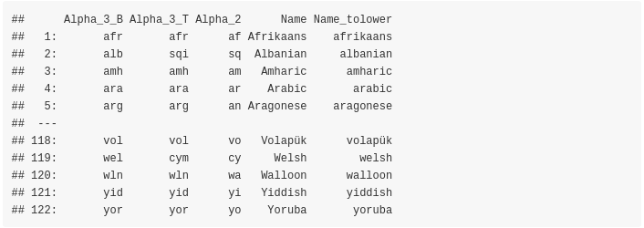

<br>

The next function will be used to compute and print the accuracy in all cases,

```{r, echo = T}

print_accuracy = function(size_input_data,
                          true_data,
                          preds_data,
                          method) {

  cat(glue::glue("Total Rows: {size_input_data}"), '\n')
  rnd_2 = round(length(preds_data)/size_input_data, 4)
  msg_2 ="Predicted Rows: {length(preds_data)}  ({rnd_2 * 100}% predicted)"
  cat(glue::glue(msg_2), '\n')
  cat(glue::glue("Missing Values:  {size_input_data - length(preds_data)}"), '\n')
  rnd_4 = round(sum(true_data == preds_data) / length(preds_data), 4)
  msg_4 = "Accuracy on 'Predicted Rows' using '{method}':  {rnd_4 * 100}%"
  cat(glue::glue(msg_4), '\n')
}

# fasttext language identification supported languages as described in https://fasttext.cc/docs/en/language-identification.html
```

<br>

As mentioned earlier the *WiLI benchmark dataset* can be downloaded either from [Zenodo](https://zenodo.org/record/841984#.YH3BBupRUV1) or from my [Datasets](https://github.com/mlampros/DataSets) Github repository. Once downloaded and unzipped the folder includes the following files (for the remaining of this blog post I'll assume that the **dir_wili_2018** variable points to the *WiLI* data directory ),

```{r}

list.files(dir_wili_2018)

```


<br>

For this benchmark we'll use only the **test** data ('x_test.txt' and 'y_test.txt' files) and we'll keep only the *WiLI-isocodes* that intersect with the *fastText isocodes*,


```{r}

pth_x_test = file.path(dir_wili_2018, 'x_test.txt')
wili_test_x = data.table::fread(file = pth_x_test, sep = '\n', stringsAsFactors = F, header = F, nThread = parallel::detectCores())

pth_y_test = file.path(dir_wili_2018, 'y_test.txt')
wili_test_y = data.table::fread(file = pth_y_test, sep = '\n', stringsAsFactors = F, header = F, nThread = parallel::detectCores())
nrow_init = nrow(wili_test_y)

inters_labels = which(wili_test_y$V1 %in% isocodes_fasttext$Alpha_3_B)

# subset both the 'x_test' and the 'y_test' data

wili_test_x = wili_test_x[inters_labels, ]
wili_test_y = wili_test_y[inters_labels, ]

cat(glue::glue("Initial observations:  {nrow_init}  Subset based on isocodes:  {nrow(wili_test_y)}   Number of languages based on subset:  {length(unique(wili_test_y$V1))}"), '\n')

head(wili_test_y)

```


<br>

### fastText based on the smaller pre-trained model 'lid.176.ftz' (approx. 917 kB)

<br>

First, we'll use the [smaller pre-trained dataset](https://fasttext.cc/docs/en/language-identification.html),


```{r, echo = T}

file_ftz = system.file("language_identification/lid.176.ftz", package = "fastText")

dtbl_res_in = fastText::language_identification(input_obj = wili_test_x$V1,
                                                pre_trained_language_model_path = file_ftz,
                                                k = 1,
                                                th = 0.0,
                                                threads = 1,
                                                verbose = TRUE)
```


```{r, echo = T}

dtbl_res_in$true_label = wili_test_y$V1
# dtbl_res_in

isocodes_fasttext_subs = isocodes_fasttext[, c(1,3)]   # merge the predicted labels with the 3-letter isocodes

merg_labels = merge(dtbl_res_in, isocodes_fasttext_subs, by.x = 'iso_lang_1', by.y = 'Alpha_2')
# as.vector(colSums(is.na(merg_labels)))

print_accuracy(size_input_data = nrow(wili_test_y), 
               true_data = merg_labels$true_label, 
               preds_data = merg_labels$Alpha_3_B, 
               method = 'fastText (.ftz pre-trained model)')

```


<br>

The **accuracy** of the model was **83.05%** (on **50211** out of **50500** text extracts)

<br>

### fastText based on the bigger pre-trained model 'lid.176.bin' (approx. 126 MB)

<br>

Let's move to the bigger pre-trained model which is mentioned to be more accurate. This model can be downloaded either from the [official website](https://www.un.org/en/about-us/universal-declaration-of-human-rights) or from my [Datasets](https://github.com/mlampros/DataSets) Github repository. The parameter setting of the **fastText::language_identification()** function is the same as before, and the only thing that changes is the **pre_trained_language_model_path** parameter which is set to **lid.176.bin**. Assuming this file is downloaded and extracted in the **dir_wili_2018** directory then,


```{r, echo = T}

file_bin = file.path(dir_wili_2018, 'lid.176.bin')

dtbl_res_in = fastText::language_identification(input_obj = wili_test_x$V1,
                                                pre_trained_language_model_path = file_bin,
                                                k = 1,
                                                th = 0.0,
                                                threads = 1,
                                                verbose = TRUE)
```


```{r, echo = T}

dtbl_res_in$true_label = wili_test_y$V1
# dtbl_res_in

isocodes_fasttext_subs = isocodes_fasttext[, c(1,3)]   # merge the predicted labels with the 3-letter isocodes

merg_labels = merge(dtbl_res_in, isocodes_fasttext_subs, by.x = 'iso_lang_1', by.y = 'Alpha_2')
# as.vector(colSums(is.na(merg_labels)))

print_accuracy(size_input_data = nrow(wili_test_y), 
               true_data = merg_labels$true_label, 
               preds_data = merg_labels$Alpha_3_B, 
               method = 'fastText (.ftz pre-trained model)')

```


<br>

The **accuracy** based on the bigger model was increased to **86.55%** (on **50168** out of **50500** text extracts)

<br>

### ggplot visualization of the bigger .bin model

<br>

The following plot shows the confusion matrix of the bigger .bin model. The main diagonal is dominated by the dark green color indicating higher accuracy rates,

```{r, echo = T}

tbl = table(merg_labels$true_label, merg_labels$Alpha_3_B)

df = as.data.frame.table(tbl)
colnames(df) = c('country_vert', 'country_horiz', 'Freq')
# head(df)

require(magrittr)
require(dplyr)
require(ggplot2)

df <- df %>%
  mutate(country_vert = factor(country_vert),                 # alphabetical order by default
         country_horiz = factor(country_horiz, levels = rev(unique(country_horiz))))

plt_tbl = ggplot(df, aes(x=country_vert, y=country_horiz, fill=Freq)) +
  geom_tile() + theme_bw() + coord_equal() +
  scale_fill_distiller(palette="Greens", direction=1) +
  ggplot2::theme(axis.text.x = element_text(angle = 45, vjust = 1.0, hjust = 1.0))    

plt_tbl

```


<br>

###  'cld2' language recognition package

<br>

The **Google's Compact Language Detector 2** (CLD2) " ... probabilistically detects over 80 languages in Unicode UTF-8 text, either plain text or HTML/XML. For mixed-language input, CLD2 returns the top three languages found and their approximate percentages of the total text bytes (e.g. 80% English and 20% French out of 1000 bytes) ...". Based on the R package documentation, "The function 'detect_language()' is vectorised and guesses the language of each string in text or returns NA if the language could not reliably be determined."

```{r, echo = T}

require(cld2)

t_start = proc.time()
cld2_vec = cld2::detect_language(text = wili_test_x$V1, plain_text = TRUE, lang_code = TRUE)

cld2_dtbl = data.table::setDT(list(Alpha_2 = cld2_vec))
cld2_dtbl$true_label = wili_test_y$V1

merg_labels_cld2 = merge(cld2_dtbl, isocodes_fasttext_subs, by = 'Alpha_2')
# as.vector(colSums(is.na(merg_labels_cld2)))

print_accuracy(size_input_data = nrow(wili_test_y),
               true_data = merg_labels_cld2$true_label,
               preds_data = merg_labels_cld2$Alpha_3_B,
               method = 'cld2')

```

```{r, echo = F}

fastText:::compute_elapsed_time(t_start)

```

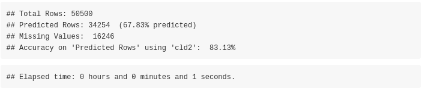

<br>

The **accuracy** of the **cld2** package is **83.13%** (on **34254** out of **50500** text extracts)

<br>

### 'cld3' language recognition package

<br>

The " ... Google's Compact Language Detector 3 is a neural network model for language identification and the successor of CLD2 (available from) CRAN. This version is still experimental and uses a novell algorithm with different properties and outcomes. For more information see: https://github.com/google/cld3#readme ...". Based on the R package documentation, "The function detect_language() is vectorised and guesses the language of each string in text or returns NA if the language could not reliably be determined."

```{r, echo = T}

require(cld3)

t_start = proc.time()
cld3_vec = cld3::detect_language(text = wili_test_x$V1)

cld3_dtbl = data.table::setDT(list(Alpha_2 = cld3_vec))
cld3_dtbl$true_label = wili_test_y$V1

merg_labels_cld3 = merge(cld3_dtbl, isocodes_fasttext_subs, by = 'Alpha_2')
# as.vector(colSums(is.na(merg_labels_cld3)))

print_accuracy(size_input_data = nrow(wili_test_y),
               true_data = merg_labels_cld3$true_label,
               preds_data = merg_labels_cld3$Alpha_3_B, 
               method = 'cld3')

```

```{r, echo = F}

fastText:::compute_elapsed_time(t_start)

```


<br>

The **accuracy** of the **cld3** package is **74.74%** (on **43560** out of **50500** text extracts)

<br>

### Language recognition using the 'textcat' R package

<br>

The 'textcat' R package performs 'text categorization based on n-grams'. The documentation of the package mentions: "... TextCat (https://www.let.rug.nl/vannoord/TextCat/) is a Perl implementation of the Cavnarand  Trenkle  'N-Gram-Based  Text  Categorization' technique by Gertjan van Noord which was subsequently integrated into SpamAssassin.  It provides byte n-gram profiles for 74 'languages' (more precisely, language/encoding combinations). The C library reimplementation libtextcat (https://software.wise-guys.nl/libtextcat/) adds one more non-empty profile. 

* 'TC_byte_profiles' provides these byte profiles. 
* 'TC_char_profiles' provides a subset of 56 character profiles obtained by converting the byte sequences to UTF-8 strings where possible.

The  category ids are unchanged from the original, and give  the  full  (English)  name  of  the  language, optionally combined the name of the encoding script.  Note that 'scots' indicates Scots, the Germanic language variety historically spoken in Lowland Scotland and parts of Ulster, to be distinguished from Scottish Gaelic (named 'scots_gaelic' in the profiles), the Celtic language variety spoken in most of the western Highlands and in the Hebrides (see https://en.wikipedia.org/wiki/Scots_language) ..."

<br>

Apart from the previous 2 mentioned TC-profiles the **ECIMCI_profiles** (26 profiles) also exists. In my benchmark I'll use only the *'TC_byte_profile'* (75 profiles) and *'TC_char_profiles'* (56 profiles) as input to the **textcat()** function to compute the country names, which by default the *textcat()* function returns. I'll wrap the function to **parallel::mclapply()** because I observed it returns the results faster using multiple threads (in my benchmark I used 8 threads). 

<br>

#### using the 'TC_byte_profiles'

<br>

Before proceeding lets have a look to the available profiles,

<br>

```{r, echo = T}

threads = parallel::detectCores()
require(textcat)

names(textcat::TC_byte_profiles)

```

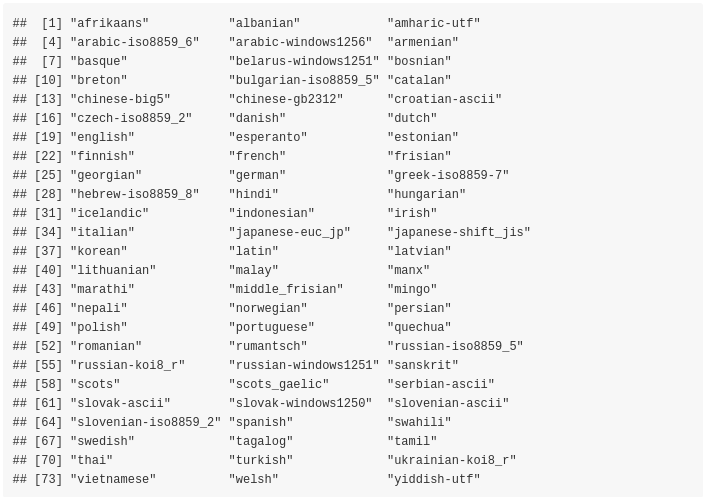

<br>

What we want is that the initial *lowercase isocodes* intersect with the processed *TC_byte_profiles* so that the computation of the accuracy is correct,

```{r}

nams_profiles = as.vector(unlist(lapply(strsplit(names(textcat::TC_byte_profiles), '-'), function(x) x[1])))
nams_profiles = unique(nams_profiles)
cat(glue::glue("Isocode-Names:  {length(unique(isocodes_fasttext$Name_tolower))}  TC_byte_profiles:  {length(names(textcat::TC_byte_profiles))}  Intersected Names: {length(intersect(nams_profiles, unique(isocodes_fasttext$Name_tolower)))}"), '\n')

```

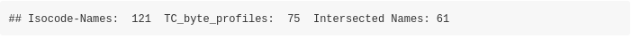

<br>


```{r, echo = T}

t_start = proc.time()
textc = as.vector(unlist(parallel::mclapply(1:length(wili_test_x$V1), function(x) {
  textcat(x = wili_test_x$V1[x], p = textcat::TC_byte_profiles, method = "CT")
}, mc.cores = threads)))

textc = as.vector(unlist(lapply(strsplit(textc, '-'), function(x) x[1])))
textc = trimws(textc, which = 'both')

unique(textc)
```


<br>

```{r, echo = T}

textc_dtbl = data.table::setDT(list(Name_tolower = textc))
textc_dtbl$true_label = wili_test_y$V1

fasttext_isoc_name = isocodes_fasttext[, c(1,5)]
merg_labels_textc = merge(textc_dtbl, fasttext_isoc_name, by = 'Name_tolower')
# as.vector(colSums(is.na(merg_labels_cld2)))

print_accuracy(size_input_data = nrow(wili_test_y), 
               true_data = merg_labels_textc$true_label,
               preds_data = merg_labels_textc$Alpha_3_B,
               method = 'textcat ( TC_byte_profiles )')
```

```{r, echo = F}

fastText:::compute_elapsed_time(t_start)

```


<br>

The **accuracy** of the **textcat** package using the **TC_byte_profiles** is **29.91%** (on **47324** out of **50500** text extracts)

<br>

#### using the 'TC_char_profiles'

<br>

Again, as previously we can have a look to the available profiles,

<br>

```{r, echo = T}

names(textcat::TC_char_profiles)

```


<br>

What we want is that the initial *lowercase isocodes* intersect with the processed *TC_char_profiles* so that the computation of the accuracy is correct,

```{r}

nams_profiles = as.vector(unlist(lapply(strsplit(names(textcat::TC_char_profiles), '-'), function(x) x[1])))
nams_profiles = unique(nams_profiles)
cat(glue::glue("Isocode-Names:  {length(unique(isocodes_fasttext$Name_tolower))}  TC_char_profiles:  {length(names(textcat::TC_char_profiles))}  Intersected Names: {length(intersect(nams_profiles, unique(isocodes_fasttext$Name_tolower)))}"), '\n')

```

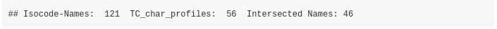

<br>


```{r, echo = T}

t_start = proc.time()
textc = as.vector(unlist(parallel::mclapply(1:length(wili_test_x$V1), function(x) {
  textcat(x = wili_test_x$V1[x], p = textcat::TC_char_profiles, method = "CT")
}, mc.cores = threads)))

textc = as.vector(unlist(lapply(strsplit(textc, '-'), function(x) x[1])))
textc = trimws(textc, which = 'both')

unique(textc)
```

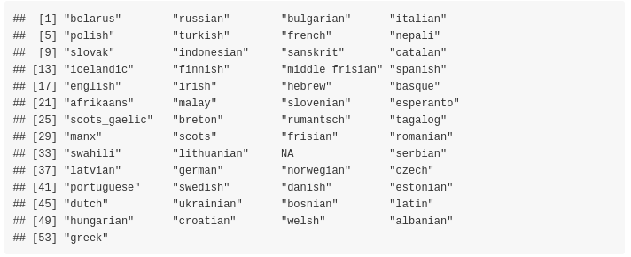

<br>

```{r, echo = T}

textc_dtbl = data.table::setDT(list(Name_tolower = textc))
textc_dtbl$true_label = wili_test_y$V1

fasttext_isoc_name = isocodes_fasttext[, c(1,5)]
merg_labels_textc = merge(textc_dtbl, fasttext_isoc_name, by = 'Name_tolower')
# as.vector(colSums(is.na(merg_labels_cld2)))

print_accuracy(size_input_data = nrow(wili_test_y), 
               true_data = merg_labels_textc$true_label,
               preds_data = merg_labels_textc$Alpha_3_B,
               method = 'textcat ( TC_char_profiles )')
```

```{r, echo = F}

fastText:::compute_elapsed_time(t_start)

```


<br>

The **accuracy** of the **textcat** package using the **TC_char_profiles** is **31.10%** (on **43265** out of **50500** text extracts)

<br>

### Language recognition using the 'franc' R package

<br>

The [R package port of Franc](https://github.com/gaborcsardi/franc) has no external dependencies and supports *310 languages*. All languages spoken by more than one million speakers. Franc is a port of the [JavaScript project](https://github.com/wooorm/franc) of the same name. Based on the documentation of the [JavaScript project](https://github.com/wooorm/franc), *" ... franc supports many languages, which means it's easily confused on small samples. Make sure to pass it big documents to get reliable results ..."*

<br>

The **franc()** function expects a text extract, therefore we will wrap the function with **parallel::mclapply()** as we've done with the *textcat* package to reduce the computation time. Moreover, we'll set the **min_speakers** parameter to **0** to include **all** languages known by franc (increasing the *max_length* parameter to *4096* does not improve the accuracy for this specific data / text extracts),

```{r, echo = T}

require(franc)

t_start = proc.time()
franc_res = as.vector(unlist(parallel::mclapply(1:length(wili_test_x$V1), function(x) {
  franc(text = wili_test_x$V1[x], min_speakers = 0, min_length = 10, max_length = 2048)
}, mc.cores = threads)))

franc_dtbl = data.table::setDT(list(franc = franc_res, true_label = wili_test_y$V1))
# as.vector(colSums(is.na(franc_dtbl)))

print_accuracy(size_input_data = nrow(wili_test_y), 
               true_data = franc_dtbl$true_label, 
               preds_data = franc_dtbl$franc, 
               method = 'franc')

```

```{r, echo = F}

fastText:::compute_elapsed_time(t_start)

```


<br>

The **accuracy** of the **franc** package is **62.04%** (on **50500** out of **50500** text extracts)

<br>

### Overview datatable of all methods

<br>

Sorted by **Accuracy** (highest better),

```{r, echo = F}

dtbl_bench = data.table::setDT(list(method = c('fastText (ftz)', 'fastText (bin)', 'cld2', 'cld3', 'textcat (byte)', 'textcat (char)', 'franc'),
                                    rows = c(50500, 50500, 50500, 50500, 50500, 50500, 50500),
                                    pred_rows = c(50211, 50168, 34254, 43560, 47324, 43265, 50500),
                                    pred_perc = c(99.43, 99.34, 67.83, 86.26, 93.71, 85.67, 100.0),
                                    NAs = c(289, 332, 16246, 6940, 3176, 7235, 0),
                                    accuracy = c(83.05, 86.55, 83.13, 74.74, 29.91, 31.1, 62.04),
                                    seconds = c(5, 5, 2, 18, 83, 100, 179),
                                    threads = c(1, 1, 1, 1, 8, 8, 8)))
```

```{r, echo = F}
dtbl_bench = dtbl_bench[order(dtbl_bench$accuracy, decreasing = T), ]
dtbl_bench

```

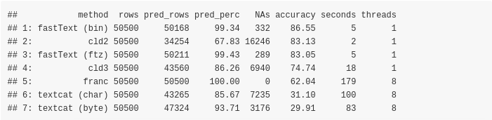

<br>

Sorted by **predicted percentage of text extracts** (highest better),


```{r, echo = F}
dtbl_bench = dtbl_bench[order(dtbl_bench$pred_perc, decreasing = T), ]
dtbl_bench

```

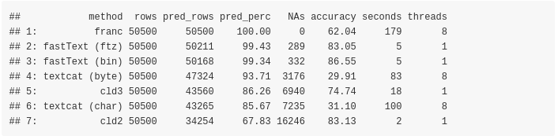

<br>

Sorted by **missing values** (lowest better),


```{r, echo = F}
dtbl_bench = dtbl_bench[order(dtbl_bench$NAs, decreasing = F), ]
dtbl_bench

```


<br>

Sorted by **computation time** (lowest better),


```{r, echo = F}
dtbl_bench = dtbl_bench[order(dtbl_bench$seconds, decreasing = F), ]
dtbl_bench

```

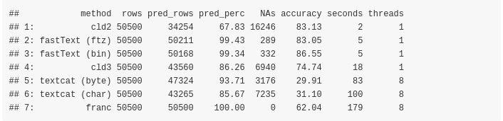

<br>

### Benchmark based on the Human Rights Declaration files

<br>

We can test the mentioned functions also using the **Declaration of Human Rights** text files, which are smaller in size and can give hints on potential misclassifications. As I mentioned at the beginning of this blog post the data can be downloaded from two different internet sources. I'll use only 3 files from the *official website* based on the **total number of speakers worldwide** (the first 3 are: **Chinese**, **English**, **Spanish**) and you can see the full list of the most spoken languages worldwide in the correponding [wikipedia article](https://en.wikipedia.org/wiki/List_of_languages_by_total_number_of_speakers).

Assuming the **.zip** file is downloaded and extracted in the **dir_wili_2018** directory and the folder name that includes the files is named as **declaration_human_rights** then,

```{r, eval = F, echo = T}

dir_files = file.path(dir_wili_2018, 'declaration_human_rights')

```

```{r, echo = T}

lst_files = list.files(dir_files, full.names = T, pattern = '.pdf')

decl_dat = lapply(1:length(lst_files), function(x) {
  
  iter_dat = pdftools::pdf_text(pdf = lst_files[x])
  lang = trimws(unlist(strsplit(gsub('.pdf', '', basename(lst_files[x])), '_')), which = 'both')
  lang = lang[length(lang)]
  vec_txt = as.vector(unlist(trimws(iter_dat, which = 'both')))
  vec_txt = as.vector(sapply(vec_txt, function(x) gsub('\n', '', x)))
  
  idx_lang = which(isocodes_fasttext$Name_tolower == lang)
  isocode_3_language = rep(isocodes_fasttext$Alpha_3_B[idx_lang], length(vec_txt))
  isocode_2_language = rep(isocodes_fasttext$Alpha_2[idx_lang], length(vec_txt))
  language = rep(lang, length(vec_txt))
  
  dtbl = data.table::setDT(list(isocode_3_language = isocode_3_language,
                                isocode_2_language = isocode_2_language,
                                language = language,
                                text = vec_txt))
  dtbl
})

decl_dat = data.table::rbindlist(decl_dat)

```

```{r, echo = F}

decl_dat$language
decl_dat$isocode_3_language
decl_dat$isocode_2_language

```

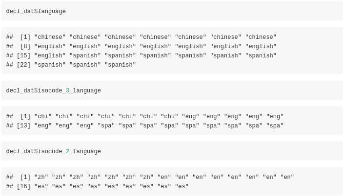

<br>

The output *data.table* includes besides the *language* also the language *isocodes* (consisting of 2 and 3 letters) and the *text extracts*. We can start to identify the language of these extracts using the **fastText** R package and utilizing the *small* pre-trained *'lid.176.ftz'* model,

```{r, echo = T}

dtbl_res_in = fastText::language_identification(input_obj = decl_dat$text,
                                                pre_trained_language_model_path = file_ftz,
                                                k = 1,
                                                th = 0.0,
                                                threads = 1,
                                                verbose = TRUE)
```


```{r, echo = F}

dtbl_res_in

```


<br>

To validate the results we will use the **isocode_2_language** column of the previous computed **decl_dat** data.table,

```{r, echo = T}

print_accuracy(size_input_data = length(dtbl_res_in$iso_lang_1),
               true_data = decl_dat$isocode_2_language,
               preds_data = dtbl_res_in$iso_lang_1,
               method = 'fastText (.ftz pre-trained model)')

```


There are no misclassifications for the 24 input text extracts using the *fastText* algorithm. We can move to the **cld2** R package and the corresponding language identification function,

```{r, echo = T}

cld2_vec = cld2::detect_language(text = decl_dat$text, 
                                 plain_text = TRUE, 
                                 lang_code = TRUE)
cld2_vec

```

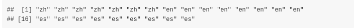

<br>

```{r, echo = T}

print_accuracy(size_input_data = nrow(decl_dat), 
               true_data = decl_dat$isocode_2_language, 
               preds_data = cld2_vec, 
               method = 'cld2')

```

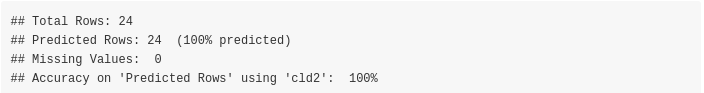

There are no misclassifications for the **cld2** algorithm too. We'll test also **cld3**,

<br>

```{r, echo = T}

cld3_vec = cld3::detect_language(text = decl_dat$text)
cld3_vec

```

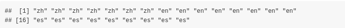

<br>

```{r, echo = T}

print_accuracy(size_input_data = nrow(decl_dat),
               true_data = decl_dat$isocode_2_language,
               preds_data = cld3_vec,
               method = 'cld3')

```


There are no misclassifications for the **cld3** algorithm, so we move to the **textcat** R package. The **'TC_byte_profiles'** include the **'chinese-gb2312'** language characters therefore we'll use these profiles in the **textcat** function,

<br>

```{r, echo = T}

textc = textcat(x = decl_dat$text, p = textcat::TC_byte_profiles, method = "CT") 
textc

```


<br>

```{r, echo = T}

textc = as.vector(unlist(lapply(strsplit(textc, '-'), function(x) x[1])))
textc = trimws(textc, which = 'both')
textc

```


<br>

```{r, echo = T}

print_accuracy(size_input_data = nrow(decl_dat), 
               true_data = decl_dat$language, 
               preds_data = textc, 
               method = 'textcat')

```

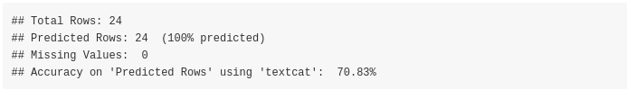

The **textcat** package misclassifies the *chinese text extracts* as *'japanese-shift_jis'*, therefore the accuracy *drops to approx. 70%*. Finally, we'll test the **franc** package,

<br>

```{r, echo = T}

franc_vec = as.vector(sapply(decl_dat$text, function(x) {
  franc(text = x, min_length = 10, max_length = 2048)
}))

franc_vec

```

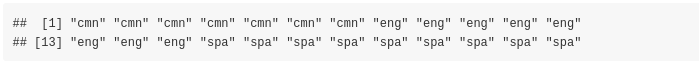

<br>

```{r, echo = T}

print_accuracy(size_input_data = nrow(decl_dat),
               true_data = decl_dat$isocode_3_language,
               preds_data = franc_vec,
               method = 'franc')

```

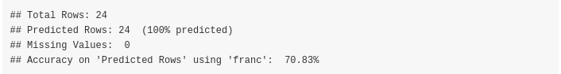

The **franc** function identified the *chinese* text excerpts as *mandarin* chinese, therefore I personally would not consider these as misclassifications (as *mandarin* is a dialect of the chinese language). We can have an overview of the results of the different methods by illustrating the outputs in a single data.table,

<br>

```{r, echo = T}

dtbl_out = decl_dat[, 1:3]
colnames(dtbl_out) = c('true_y_iso_3', 'true_y_iso_2', 'true_y_language')
# dtbl_out

dtbl_preds = data.table::setDT(list(fastText = dtbl_res_in$iso_lang_1,
                                    cld2 = cld2_vec,
                                    cld3 = cld3_vec,
                                    textcat = textc,
                                    franc = franc_vec))
# dtbl_preds

dtbl_out = cbind(dtbl_out, dtbl_preds)
dtbl_out

```


<br>

### Comparison between 'fastText', 'cl2', 'cl3' and 'franc' for Multilingual output

<br>

Finally, we can observe the output of **fastText**, **cl2**, **cl3** and **franc** for Multilingual output (I'll exclude the **textcat::textcat()** function, because it expects a single language per character string in the input vector). 

* We will first tokenize all three **Declaration of Human Rights** text files, then 
* we will sample a specific number of words of the tokenized output and 
* build a sentence that will be classified using the mentioned algorithms. 

In order to verify the results and see how each algorithm performs we will pick **100 words** of each declaration file. Due to the fact that the **chinese** language has **ambiguous word boundaries** we will use the **stringi::stri_split_boundaries()** function of the **stringi** R package to extract the words of the chinese text file. The following function shows the pre-processing steps to come to the multilingual sentence,

<br>

```{r, echo = T}

lst_files = list.files(dir_files, full.names = F, pattern = '.pdf')

min_letters_en_es = 3         # min. number of characters for the 'en' and 'es' languages
sample_words = 100            # sample that many words from each tokenized file

decl_dat = lapply(1:length(lst_files), function(x) {
  
  iter_dat = pdftools::pdf_text(pdf = file.path(dir_files, lst_files[x]))
  
  dat_txt = sapply(iter_dat, function(y) {
    
    if (lst_files[x] == 'declaration_human_rights_chinese.pdf') {
      res_spl_lang = stringi::stri_split_boundaries(str = y, 
                                                    type = 'word', 
                                                    skip_word_none = TRUE, 
                                                    skip_word_letter = TRUE,
                                                    skip_word_number = TRUE)
    }
    else {
      res_spl_lang = stringi::stri_split(str = y, 
                                         regex = '[ \n,]',
                                         omit_empty = TRUE,
                                         tokens_only = TRUE)
    }
    
    res_spl_lang = trimws(res_spl_lang[[1]], which = 'both')
    idx_empty = which(res_spl_lang == "")
    if (length(idx_empty) > 0) {
      res_spl_lang = res_spl_lang[-idx_empty]
    }
    if (!is.null(min_letters_en_es) & lst_files[x] != 'declaration_human_rights_chinese.pdf') {
      nchars = nchar(res_spl_lang)
      idx_chars = which(nchars >= min_letters_en_es)
      if (length(idx_chars) > 0) {
        res_spl_lang = res_spl_lang[idx_chars]
      }
    }
    res_spl_lang
  })
  
  dat_txt = as.vector(unlist(dat_txt))
  set.seed(1)
  sample_words = sample(dat_txt, sample_words)
  sample_words
})


decl_dat = as.vector(unlist(decl_dat))
decl_dat = decl_dat[sample(1:length(decl_dat), length(decl_dat))]
multilingual_sentence = paste(decl_dat, collapse = ' ')
multilingual_sentence

```


<br>

We deliberately mixed the words by first sampling the vector and then concatenating the tokens to a sentence. The purpose of the multilingual identification is to find out if each algorithm detects the *correct languages* assuming the *number of languages* in the text are *known beforehand*. 

Imagine, you have 3 people having a conversation in a room where interchangeably a different language is spoken and this conversation is recorded by a fourth person. 

<br>

```{r, echo = T}

num_languages = 3

```

<br>

#### **fastText Multilingual**

<br>

```{r, echo = T}

dtbl_multiling = fastText::language_identification(input_obj = multilingual_sentence,
                                                   pre_trained_language_model_path = file_ftz,
                                                   k = num_languages,
                                                   th = 0.0,
                                                   threads = 1,
                                                   verbose = FALSE)
dtbl_multiling

```

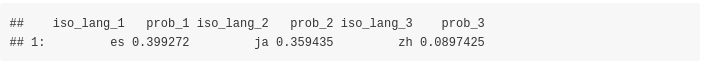

<br>

#### **cld2 Multilingual**

<br>

```{r, echo = T}

cld2::detect_language_mixed(text = multilingual_sentence, plain_text = TRUE)$classification

```


<br>

#### **cld3 Multilingual**

<br>

```{r, echo = T}

cld3::detect_language_mixed(text = multilingual_sentence, size = num_languages)

```

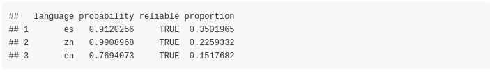

<br>

#### **franc Multilingual**

<br>

```{r, echo = T}

# we could use the 'whitelist' parameter but the purpose is to identify languages from unknown text

franc::franc_all(text = multilingual_sentence, max_length = nchar(multilingual_sentence) + 1)[1:num_languages, ]

```

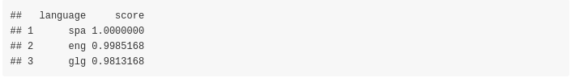

<br>

From the results one can come to the following **conclusions**:

* the **cld2** *detect_language_mixed()* function detects the correct languages without even specifying how many languages are in the text
* the **cld3** *detect_language_mixed()* function detects the correct languages (as *cld2*) but with the *limitation* that we have to specify the number of languages beforehand
* the **fastText** function, detects 2 out of the 3 languages and the false detected one (*japanese*) seems to receive a higher probability than *chinese* (*english* is not detected at all)
* the **franc**  *franc_all()* function detects correctly 2 out of the 3 languages (*english* and *spanish*) but not chinese (the third language based on score is *Galician*)

<br>


